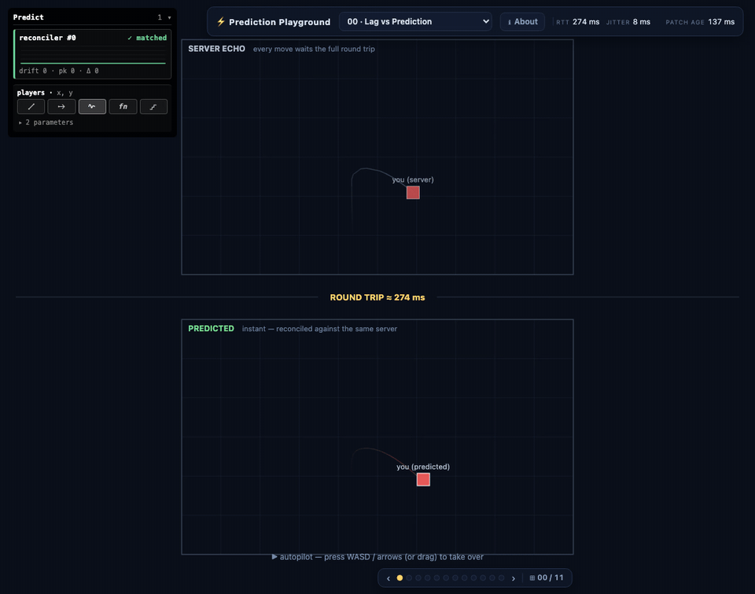
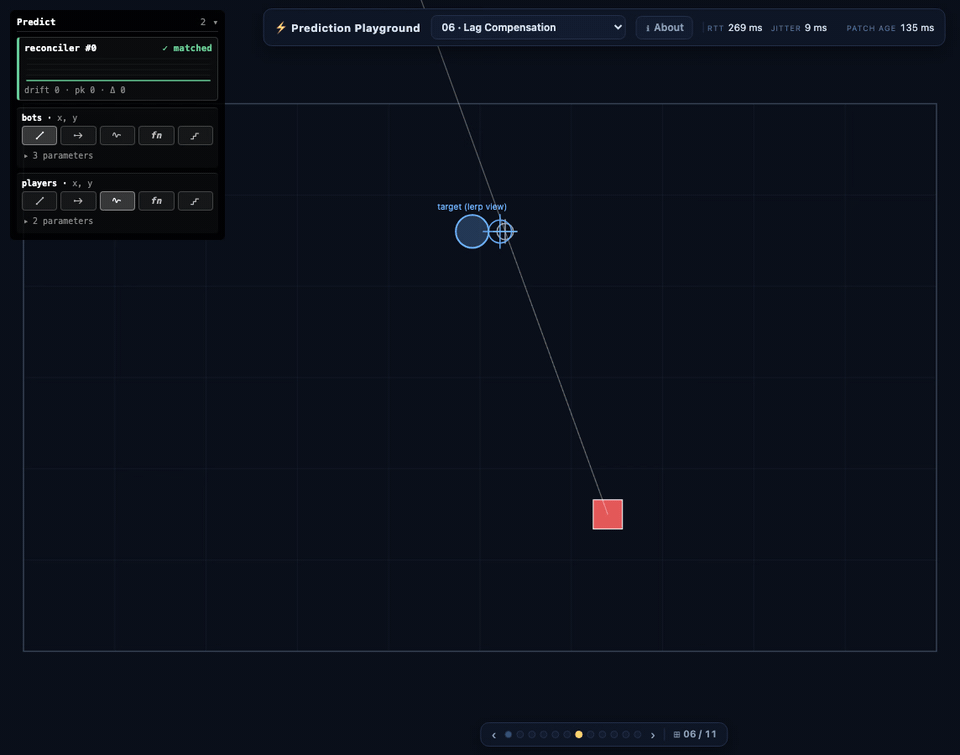
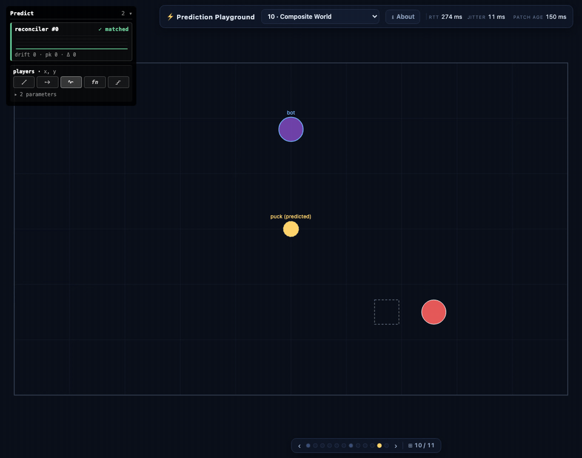
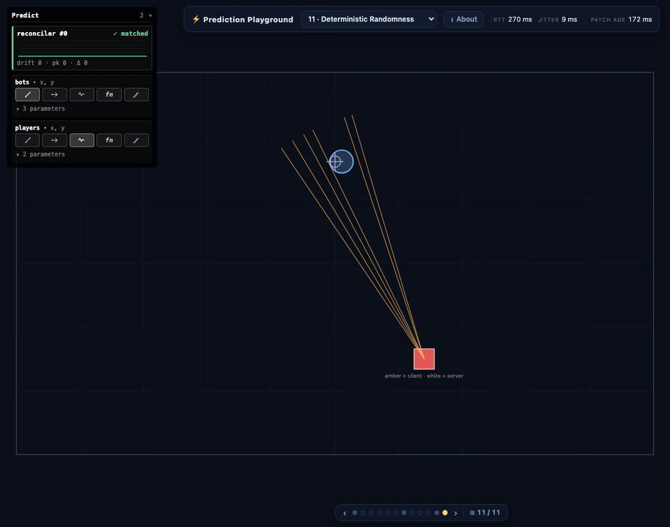
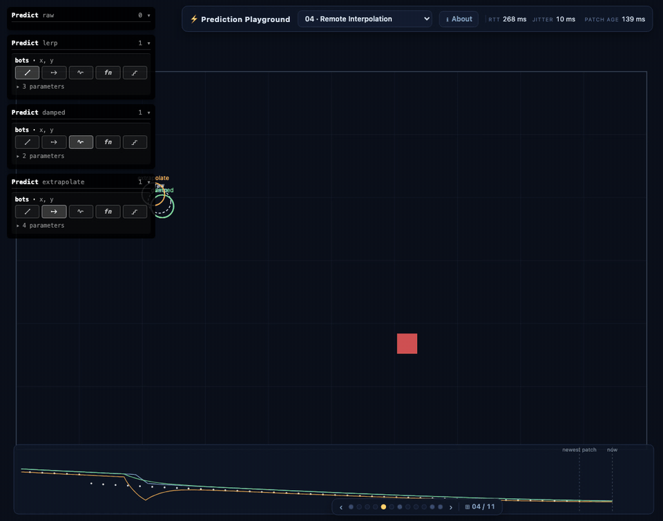

# ⚡ Colyseus Prediction Playground

[](LICENSE)
[](https://github.com/colyseus/colyseus)

An interactive, educational tour of **every client-prediction and lag-compensation
technique** in Colyseus 0.18 — the same stack behind the air-hockey, FPS, MOBA,
platformer, and racing demos, distilled into eleven small labs. Each lab isolates
one concept with a tiny top-down sim, live knobs, and visualizations of what the
SDK is doing (server ghosts, pending-input chips, rewind markers, buffer
timelines).



*The opening split screen: the **same entity in the same room**, rendered twice
at 200 ms of injected latency — raw server echo above, client prediction below.*

**Live demo:** coming once the Colyseus 0.18 packages are published.

## The labs

| # | Lab | Concept | SDK surface |
|---|-----|---------|-------------|
| 00 | Lag vs Prediction | The split screen: echo vs predicted | Lab 03's code, verbatim |
| 01 | Feel the Lag | Why raw server state feels bad | `room.input()` only |
| 02 | Clocks & Timelines | `now` / `serverNow` / `renderNow`, RTT, jitter | `room.clock.*` |
| 03 | Predict & Reconcile | Rollback + replay + smoothed corrections | `predict.reconciler` |
| 04 | Remote Interpolation | lerp / damped / extrapolate / raw, overlaid | `attachAll` modes |
| 05 | Dead Reckoning | Forward-simulate remotes with the shared step | `mode:"reckon"` |
| 06 | Lag Compensation | The server rewinds targets to what you saw | `allowRewindState`, `lastSeenBy` |
| 07 | WYSIWYG Collision | Hit-test at the rewind instant, freeze verdicts | `valueAt(reckonTime)`, `ctx.memo` |
| 08 | Optimistic Events | Instant feedback; confirm or reject | `defineEvent`, `ctx.predict` |
| 09 | Predicted Spawns | Optimistic projectile → authoritative handoff | `predict.spawns` |
| 10 | Composite World | Predict a world you only partly control | `predict.sim` |
| 11 | Deterministic Randomness | Seeded spread, nothing on the wire | pattern (seq + salt) |

Every lab shows **the code it actually runs**: the docs panel embeds the lab's
`net.ts` via a `?raw` import, so the displayed snippet can never drift from the
executed one.

## Showcase

| | |
|---|---|
|  |  |
| **06 · Lag Compensation** — aim at what you *see*: dead-on hits at 200 ms with lag comp on; the same aim starts missing the moment it goes off. Blue = what you saw, green = the server's rewound read, red = the live position. | **10 · Composite World** — `predict.sim` runs a paddle+puck world through your inputs; the dashed server ghost trails the predicted puck by ~RTT. |
|  |  |
| **11 · Deterministic Randomness** — the client (amber) and server (white) pellet fans match to the bit, seeded by `seq ⊕ salt` with nothing on the wire — until `Math.random()` tears them apart. | **04 · Remote Interpolation** — one bot rendered four ways at once (raw / lerp / damped / extrapolate), with a timeline strip plotting received samples against each mode's output. |

## Running it

> **Heads-up:** Colyseus 0.18 is pre-release. This repo currently resolves
> `@colyseus/*` via `link:../../colyseus-0.18/*`, so `pnpm install` needs that
> sibling checkout next to it — a standalone clone won't install until the 0.18
> packages are published (this note disappears then).

```
pnpm install
pnpm dev          # client + server in ONE vite process → http://localhost:5173
```

Latency simulation, per-Predict tuning, and room inspection all come from the
**built-in `@colyseus/sdk/debug` panels** — the playground reserves the
viewport's corners for them: Predict cards dock top-left, the room debug panel
(Colyseus logo; its menu holds the latency slider, or `__net(ms, jitter)` in
the console) docks top-right. Every lab is designed to be felt at 150–250 ms.

The room panel's **Drop** button works in every lab: the server holds the seat
(`onDrop` → `allowReconnection`), the SDK auto-reconnects, and the lab re-seeds
its predictor in `room.onReconnect` — the reconnected connection counts inputs
from zero, so reconcilers must `reset()` or they'd replay the stale backlog
forever. If reconnection gives up, the shell rejoins fresh.

## Layout

```
src/shared/     deterministic sim shared verbatim by client & server
src/server/     one small Room per room family (7 rooms serve 12 labs)
src/client/
  framework/    lab registry, canvas helpers, controls/HUD builders, lab nav
  labs/NN-*/    index.ts (viz + wiring) · net.ts (the SDK-facing code) · docs.md
scripts/        headless probes + media capture (see below)
```

Rooms are deliberately shared across labs where the server is identical
(labs 00/01/02/03 → `lab-move`; 04/05 → `lab-bots`; 06/11 → `lab-range`): most
of these techniques are *client-side choices over the same authority*.

## Multiplayer

Every lab is joinable by multiple tabs (`joinOrCreate`) — a second tab shows up
as a remote square, and room-wide toggles (lag comp, deny rate, bot pattern)
affect everyone. Append `?private=1` for a guaranteed solo room (the probes use
this so CI never collides with an open tab).

## Verification

With `pnpm dev` running:

```
pnpm probes                       # the full suite against :5173
node scripts/probe-rewind.mjs     # one probe (optional port arg)
```

The probes assert the load-bearing claims end-to-end under simulated latency,
e.g. `probe-rewind`: *aiming at what you see hits 8/8 with lag comp ON and
0/8 with it OFF at 250 ms*; `probe-reconcile`: *drift ema is exactly 0 while
driving (deterministic shared step)*; `probe-rng`: *client and server pellet
fans match to the bit*. Puppeteer probes use `headless: "shell"` — the new
headless mode doesn't fire `requestAnimationFrame` without a screencast.

```
pnpm media                        # regenerate README GIFs + media/og.png
```

Media is captured from the live labs by the same probe machinery
(`scripts/capture-media.mjs`), so the GIFs above never go stale.

## Conventions

Same as the sibling demos: Colyseus 0.18 via `link:../../colyseus-0.18/*`,
one input per fixed tick (`setFixedTimestep` advertises the rate; dt and seq
never ride the wire), `src/shared/` is structurally-typed pure math (no schema
imports, no `Math.random`, no clocks), and `@colyseus/sdk/debug` is imported
unconditionally — inspection is this app's product.

## License

[MIT](LICENSE) © Endel Dreyer
