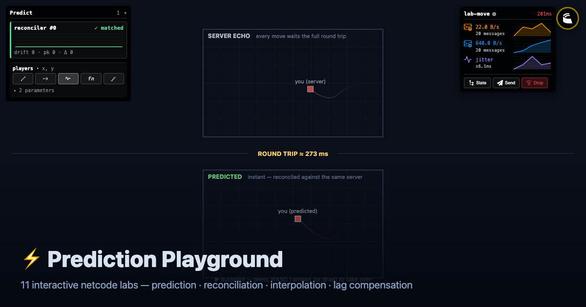

# Prediction Playground — Flutter

The playground on the [Colyseus Flutter SDK](../../../../native-sdk/platforms/flutter),
which is Dart FFI over the native C SDK. Renders through Impeller on macOS.



## Run it

Three things, in order.

**1. The playground server** — it serves the web client and the Colyseus server
from one port:

```sh
cd demos/prediction-tools
pnpm install
pnpm dev --host 0.0.0.0
```

`--host` is not optional. Without it Vite binds IPv6 loopback only, and a
native client connecting to `127.0.0.1` gets nothing.

**2. The native library** (needs [Zig](https://ziglang.org) 0.15.2):

```sh
cd native-sdk/platforms/flutter
./build.sh
```

**3. The app:**

```sh
cd demos/prediction-tools/clients/flutter-app
flutter pub get
flutter run -d macos --enable-impeller
```

Point it elsewhere with `--dart-define=PLAYGROUND_ENDPOINT=ws://host:port`.

### Impeller

macOS still runs Skia by default, so Impeller is opt-in: `--enable-impeller` on
the command line, and `FLTEnableImpeller` in `macos/Runner/Info.plist` for
builds that don't go through `flutter run`. Confirm it took by looking for this
line at startup:

```
Using the Impeller rendering backend (Metal).
```

Re-check when upgrading Flutter — the flag is expected to become the default.

## Controls

| Key | |
|---|---|
| `WASD` / arrows | move |
| `1`–`9` | switch lab |
| mouse / click / `space` | aim and fire (lab 09) |
| `[` / `]` | step through all twelve labs |
| `L` | cycle injected latency |
| `K` | drop the connection |

Everything else is in the right-hand panel, which changes per lab.

### Injected latency

Localhost has none, so most of these labs show nothing at the default preset.
The SDK injects it at the transport seam, which is the honest place to do it:
everything above — decoding, prediction, reconciliation — behaves exactly as it
would on a real connection.

## Labs

| | | |
|---|---|---|
| 00 | Lag vs Prediction | Two lanes, one entity: the top waits for the server, the bottom predicts. |
| 01 | Feel the Lag | Draws the server position directly, so every keypress waits a full round trip. |
| 02 | Clocks | Local time, estimated server time, and the slew-limited render timeline. |
| 03 | Reconcile | Predict locally; rewind and replay when the server disagrees. |
| 04 | Interp Modes | One bot drawn four ways at once, scored for smoothness. |
| 05 | Dead Reckoning | Forward-simulate the last snapshot instead of interpolating it. |
| 06 | Lag Compensation | Shoot at where you see a bot; the server rewinds to the instant you saw. |
| 07 | WYSIWYG | Evaluate a collision at the instant the input was stamped, and freeze the verdict. |
| 08 | Optimistic Events | Show a goal the moment you predict it; confirm or retract when the server rules. |
| 09 | Predicted Spawns | Fire immediately, then hand off to the server's projectile with no visible seam. |
| 10 | Composite Sim | A paddle and a puck rolled back together, because one hits the other. |
| 11 | Deterministic RNG | Both sides derive the same shotgun spread from a shared seed. |

In lab 03: your square is the prediction, the dashed ghost is the last position
the server confirmed, and the red arrow is the correction being applied. Press
**Impulse** to have the server kick you in a way the client never predicted:
the arrow appears and decays rather than snapping.

Lab 05 is worth setting to `wander`. Patrol and circle track exactly, because
the client can compute them; wander re-rolls its heading from a seed only the
server has, so dead reckoning visibly breaks. That is the honest limit of the
technique, not a bug.

The pending chips are inputs applied locally that the server hasn't confirmed
yet; at 200 ms you should see three or four. Drift stays `matched` because
`lib/sim` computes exactly what the server computes.

## How it fits together

```
Ticker (vsync)
  └─ Colyseus.pump()        release inbound traffic, decode, deliver events
  └─ predict.tick(now)      → how many inputs are due this frame
  └─ input.send() × N       each one predicted immediately
  └─ CustomPainter          draw predicted positions
```

Pumping from the frame callback is what keeps decoding, prediction and drawing
on one thread and inside one frame. The SDK's own poll timer is turned off in
`shell.dart` (`Colyseus.autoPoll = false`).

| | |
|---|---|
| `lib/sim/` | The server's shared simulation, transliterated to Dart. Differential-tested against the TypeScript original — 5320 cases, zero mismatches. |
| `lib/net/schema_bridge.dart` | Runs those step functions directly over SDK storage, so there's no copy to drift. |
| `lib/gen/schema.dart` | Typed schema classes, generated from `src/server/schema/`. Regenerate after a schema change: `npx schema-codegen src/server/schema/* --dart --bundle --output clients/flutter-app/lib/gen` (from `demos/prediction-tools`). |
| `lib/labs/move_lane.dart` | Join, smooth the other players, predict and reconcile your own. Labs 03, 08 and 09 share it, each naming its own room, reconciled fields and extra step. |
| `lib/shell.dart` | Connection lifecycle, frame loop, lab switching. |

The rest (`world_view`, `draw_kit`, `hud`, `kb`, `pacer`, `trail`, `spark`,
`series`, `smoothness`, `controls`) ports the other clients' framework layer;
`clients/godot-gd-app/scripts/` is the closest reference.

## Acceptance

```sh
./run-acceptance.sh
```

Runs the real app code — real SDK, real dylib, real server — and checks:

1. the shared simulation matches the server (canaries),
2. joining `lab-move` decodes your own player,
3. prediction runs ahead and holds drift below the noise floor,
4. a server impulse registers as a correction and decays,
5. injected latency shows up in the round trip and deepens the pending window,
6. a dropped connection reconnects and prediction keeps working.

`test/lab_smoke_test.dart` and `test/lab00_smoke_test.dart` then mount every
lab, drive a few hundred real frames and render each one, which is what catches
a lab that fails to join, throws in its step, or blows up while painting.

Check 1 is the load-bearing one: if the Dart simulation has drifted from the
TypeScript, every drift reading elsewhere is measuring that instead of the
network.

## Known gaps

- macOS only so far. Nothing in the app is platform-specific; the SDK builds
  for iOS, Android, Linux and Windows, though Windows still dead-strips the
  predict layer out of the DLL (noted in `platforms/flutter/build.zig`).
