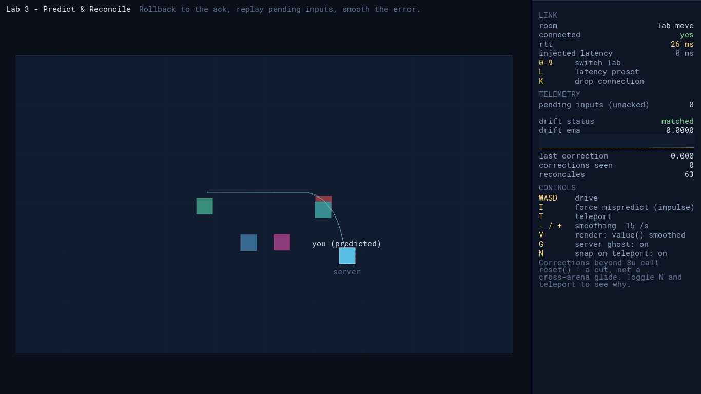
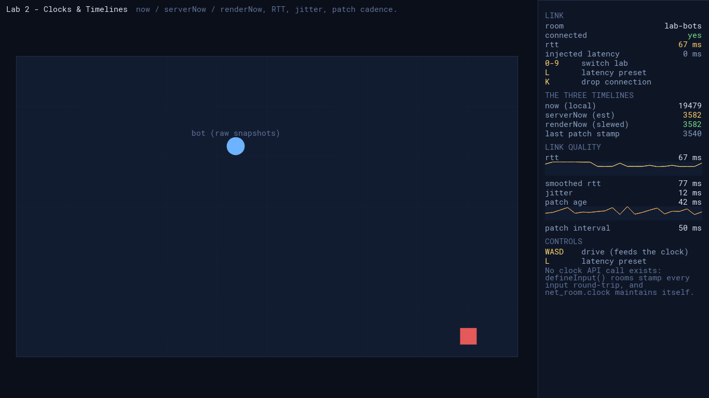
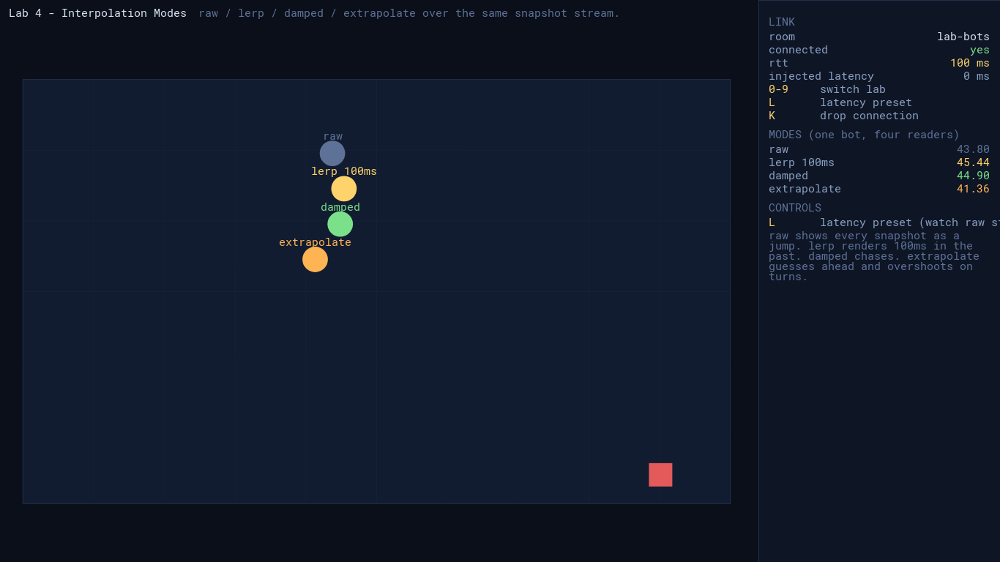
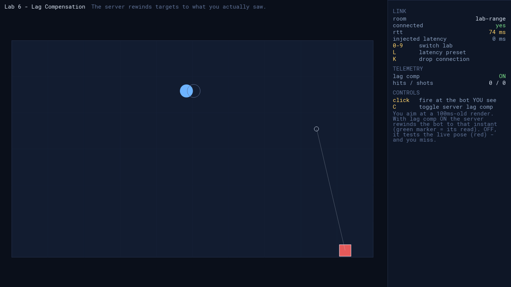
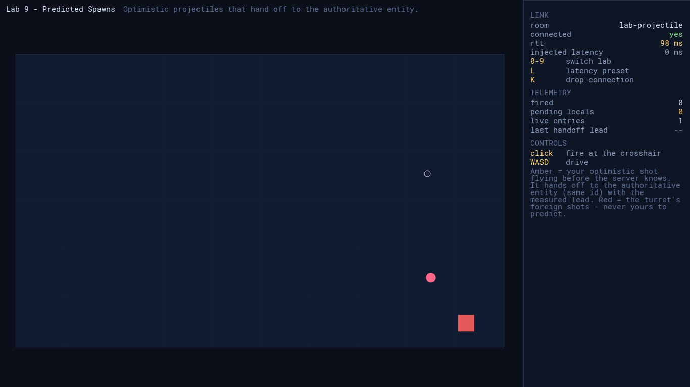

# Prediction Playground — GameMaker

The 12-lab netcode playground running on the Colyseus native SDK's GameMaker
extension (`native-sdk/platforms/gamemaker`). Same server, same shared
deterministic sim, same labs as the web / C (raylib) / Godot clients.



GameMaker's FFI can never call GML, so this port exercises the extension's
**manual-pump reconciler**: the lab's GML step function runs inside
`recon.pump()` between `pump_next`/`pump_commit` — live predictions and
rollback replays alike — while dead-reckon steps run C-side (the built-in
`INTEGRATE` projection).

## Run

```bash
# 1. the playground server (repo root)
pnpm dev --host 0.0.0.0

# 2. open PredictionPlayground.yyp in GameMaker (2024.14+) and Run,
#    or windowed via Igor without the IDE (macOS + licence):
./run.sh

# headless acceptance (same requirements):
./run-acceptance.sh
```

The HTML5 target works out of the box: pick HTML5 in the IDE and Run, or
`Igor ... -- HTML5 Run` serves it on a local port. The shared sim carries
the runner's numeric quirks already worked around in `scr_sim` (see the
comments there before touching the RNG), and `sim_selfcheck()` gates every
lab on boot, on both runners.

The extension binaries (`extensions/Colyseus_SDK/`) are copied from
`native-sdk/platforms/gamemaker` — rebuild there (`zig build`,
`./build-wasm.sh`) and re-copy `libcolyseus.dylib` / `colyseus_wasm.js`
after SDK changes. When re-copying `Colyseus_SDK.yy`, patch its `parent`
block to `PredictionPlayground.yyp`.

## Keys

| key | action |
|---|---|
| `WASD` / arrows | drive |
| `0`–`9`, `[` / `]` | switch lab (`[`/`]` reach labs 10–11) |
| `L` | latency preset 0 / 80 / 200 / 400+80j ms |
| `K` | drop the connection (auto-reconnect) |
| mouse + click | aim / fire (labs 6, 9, 11) |
| per-lab | shown in the HUD (`R V G N I T B P K C - +`) |

## Labs

| # | lab | shows |
|---|---|---|
| 00 | Split Screen | echo vs prediction, same entity |
| 01 | Feel the Lag | no prediction — the round trip, felt |
| 02 | Clocks | now / serverNow / renderNow, RTT, patch cadence |
| 03 | Predict & Reconcile | rollback + replay at wire precision |
| 04 | Interpolation Modes | raw / lerp / damped / extrapolate ×1 bot |
| 05 | Dead Reckoning | project remotes to NOW (C-side INTEGRATE) |
| 06 | Lag Compensation | the server rewinds to what you saw |
| 07 | WYSIWYG Contact | knockback vs the bot AS RENDERED (`value_at` + memo) |
| 08 | Optimistic Events | GOAL! banner → confirm / retract |
| 09 | Predicted Spawns | optimistic projectiles → authoritative handoff |
| 10 | Composite Sim | paddle + puck + contacts in one predicted world |
| 11 | Deterministic RNG | the shotgun fan derived from (seq, salt) |

Lab 05 note: bots reckon through the extension's built-in `INTEGRATE`
(+bounce) projection — patrol bots project exactly; wander/teleport bots
change heading server-side and visibly warp on reveal, which is the lab's
own lesson.

| | |
|---|---|
|  |  |
|  |  |

Screenshots for every lab live in [`media/gamemaker-app/`](../../media/gamemaker-app/).

## Acceptance

`./run-acceptance.sh` runs headlessly (`COLYSEUS_ACCEPTANCE=1`): sim
determinism canaries (splitmix32 / mulberry32 / wide-seed shotSeed / spread
fan / stepEntity), a live join, a 3-second reconciler drive asserting
`drift_ema < 0.01` (wire precision — the GML transliteration matches the
server's TS step exactly), and a server impulse forcing a visible
correction.
