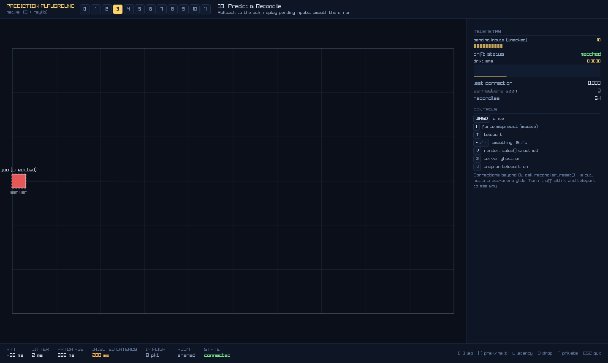

# native-app — Prediction Playground on the C SDK (raylib)

The **interactive** twin of [`clients/native`](../native) (the headless probe).
The probe proves the native predict layer is *correct*; this proves it is
*usable* — real rendering, keyboard input, a telemetry HUD, and a latency
injector, against the same server as the web playground.

Plan: [`clients/APPS_PLAN.md`](../APPS_PLAN.md). Milestone status: **M1, M2 and
M3 complete** — shell, latency injector, and all twelve labs. The SimReconciler
port lab 10 needed (APPS_PLAN §5) landed in `native-sdk` alongside it.

```
pnpm dev --host 0.0.0.0                     # --host is mandatory (native = IPv4)
brew install raylib
cd ../native-sdk && zig build
./zig-out/bin/predict_playground [port]     # default 5173
```

The exe is registered in `native-sdk/build.zig` and only appears when this repo
sits next to `native-sdk` **and** pkg-config can find raylib. `zig build
run-playground -- 5173` works too.



## Labs

| | Lab | What it shows |
|---|---|---|
| 0 | Lag vs Prediction | lab 3's netcode behind a split screen: raw server echo on top, predicted below |
| 1 | Feel the Lag | no prediction — the input→motion meter tracks the round trip |
| 2 | Clocks & Timelines | `serverNow` / `renderNow` / rtt / jitter / patch-arrival strip |
| 3 | Predict & Reconcile | reconciler over the shared `step_entity`, server ghost, correction arrows, drift telemetry |
| 4 | Remote Interpolation | raw / lerp / damped / extrapolate over one bot + a sample-vs-render timeline strip |
| 5 | Dead Reckoning | `track_reckon` over the shared `step_bot`, against a lerp ghost |
| 6 | Lag Compensation | `allow_rewind` fire-gate + lerp-delayed bots; blue/green/red shot markers |
| 7 | WYSIWYG Collision | `value_at(ctx->reckon_time)` + `step_memo` frozen verdicts |
| 8 | Optimistic Events | sim-born `step_predict` → confirm / grace-tick reject, with a deny-rate control |
| 9 | Predicted Spawns | optimistic projectile → authoritative handoff, measured input lead |
| 10 | Composite Sim | `predict.sim`: paddle AND puck in one reconciled world, bound to their decoded instances |
| 11 | Deterministic Randomness | the shotgun fan derived from (seq, salt) on both sides, nothing on the wire |

## Keys

| Key | |
|---|---|
| `WASD` / arrows | drive |
| digits, `[` `]` | switch lab (by lab number) |
| `L` | cycle latency preset — off / 80+10 / 200 / 200+80 / 400+60 ms |
| `K` | drop (kill) the transport uncleanly — exercises auto-reconnect |
| `P` | private room ↔ shared room (rejoin) |
| `F12` | screenshot to `media/native-app/manual.png` |
| `I` `T` | (3) force mispredict / teleport |
| `V` `G` `N` | (3) value()/state · server ghost · snap-on-teleport |
| `B` | (4, 5) cycle the room-wide bot pattern |
| `F1`–`F4` | (4) show/hide one interpolation mode |
| `,` `.` | (5) reckon snap threshold |
| `-` `=` | (3) smoothing · (1) damping · (5) rebase smoothing · (8) server deny rate |
| mouse / `SPACE` | (6, 9, 11) aim / fire |
| `O` | (9) toggle the optimistic spawn |
| `C` | (6) room-wide lag compensation on/off |
| `V` `M` | (7) read at reckonTime / freeze the verdict with memo |
| `X` | (11) swap in an unshared RNG and watch the fans disagree |
| `G` `B` | (10) server ghosts / the AI paddle |

## Notable ports

- **`net_delay.h` — the latency injector** (APPS_PLAN §3). A wrapper transport
  handed to `colyseus_client_create_with_transport`, so the room rebuilds it on
  every reconnect for free. Both directions are queued; each packet's deliver-at
  is clamped to ≥ the previous one's, so jitter never reorders the stream. It
  aliases the inner websocket's `impl_data` because
  `colyseus_websocket_connect_with_settings()` writes TLS config straight
  through `transport->impl_data` before calling `connect`.

  Side benefit worth keeping even at 0 ms: inbound frames are delivered from
  `nd_pump()` on the **main thread**, so every schema decode happens there and
  labs read state without a mutex.

- **`sim.h`** — the whole shared sim: `stepEntity`, `stepBot` (patrol / circle /
  wander / teleport), `stepScoreGate`, `stepProjectile`, `rayCircle`,
  `stepBumpGate`/`collideBot`, and the uint32 `splitmix32`/`mulberry32`/
  `spreadAngles` stack. Every one has a canary pinned to values produced by the
  TypeScript original — including the RNG vectors, which is the module that
  would silently break on a 31-bit-int target.

- **The SDK grew an app-facing surface while this was written.** Twelve labs
  against the raw predict API surfaced enough repeated boilerplate to be worth
  fixing in `native-sdk` rather than papering over here — `predict_tick()`
  returning the due input steps, `predict_for_room` / `attach_all` /
  `bind_spawns`, reconcilers born from a Predict (which is what binds the
  lag-comp render delay), and a vector `step_memo`. The app dropped ~200 lines
  and every `room->serializer->decoder` reach-through. Labs 04 and 05 still
  pace sends by hand, on purpose: they run several Predict overlays over one
  room to compare modes, which is exactly what the web build does too.

- **Lab 10 binds both parts.** The JS version hands `predict.sim` opaque plain
  objects plus a custom `pose`; the C port passes the decoded `Player` and `Puck`
  instances as BOUND parts, so the store mirrors them and derives the
  `paddle.x` / `puck.x` pose keys itself — the auto-binding path the SDK fixture
  pins. Custom `pose`/`interpolate` overlays are not ported.

- **`render_delay` used not to be auto-bound in C** — the finding that drove the
  SDK change above. The stamp is `serverNow - (render_delay + rtt/2)`, so if it
  doesn't match the delay remote entities are DRAWN at, the server rewinds to an
  instant the client never displayed. Measured at 200 ms aiming dead-on at the
  lerp view: **3/6 hits and 99 ms of rewind error without the binding, 6/6 and
  ~65 ms with** — 99 ms being precisely the missing lerp delay.
  `colyseus_predict_reconciler()` now binds it from the Predict's lerp delay.

- **Lab 07's verdict is a vector memo.** The knockback rides one
  `colyseus_step_memo_vec("bump", ...)`, so the collision test runs exactly once
  on the live step and both components replay together. Encoding it as an angle
  would round through `atan2`/`cos` and reintroduce the drift the lab exists to
  eliminate — which is why the vector form exists.

- **Single translation unit.** schema-codegen emits `static` vtables per header,
  so one TU is what keeps every lab pointing at the *same* vtable object. `main.c`
  `#include`s the lab `.c` files.

## Verification

```
./zig-out/bin/predict_playground --selfcheck     # headless: shared-sim canary, no window
./zig-out/bin/predict_playground --demo          # full acceptance run (needs a display)
```

`--demo` is the autopilot: it switches labs, cycles latency presets, drives the
player, fires the impulse, drops the transport, writes a screenshot per
checkpoint to `media/native-app/`, and exits non-zero if any check fails. Last
run, against `pnpm dev --host 0.0.0.0`:

```
=== acceptance run: M1 + M2 (APPS_PLAN §7) ===
OK   lab01-latency-off      input->motion 171 ms at 0 injected (rtt 117) — one patch interval
OK   lab01-latency-200      input->motion 526 ms at 200 ms injected (rtt 507) — no prediction, so it tracks the round trip
OK   lab02-clock            smoothed rtt 512 ms, patch stamp flowing, jitter 6.8
OK   lab03-predicted        drift matched (ema 0.00e+00), 9 pending inputs at rtt 519 ms, 0 corrections
OK   lab03-impulse          max |correction| 4.823 after the server-side shove
OK   lab03-recovered        live |correction| 0.0000 (peak was 4.823), drift ema 0.0000 peak 0.0001 — decayed
OK   lab03-reconnected      1 reconnect(s), reconciler rebound, drift ema 0.0000, 118 reconciles
OK   lab00-split            echo lane trails the predicted lane by 10.6 u at rtt 580 ms (13 in flight)
OK   lab04-modes            speed CV raw 162% > lerp 26% (damped 40%, extrapolate 43%) — the raw square steps at the patch rate, lerp glides
OK   lab05-patrol           kind=patrol reckon x 33.51 vs lerp x 26.90 (gap 6.61 u over a 255 ms horizon)
OK   lab05-wander           kind=wander, reckon x 59.26 is 6.04 u past the newest snapshot — headings are a server secret, so it extrapolates straight through every turn and gets rebased
OK   lab08-confirmed        2 predicted, 2 confirmed at deny rate 0 % (score 2)
OK   lab08-denied           4 rejected at deny rate 100 % — the banner went up, then retracted
OK   lab09-spawn            1 fired, authoritative entity correlated in place, measured input lead 564 ms
OK   lab06-shot             6/6 hits (100 %) aiming dead-on at the lerp view, rtt 511 ms; the server rewound to within 1.79 u of what I saw while live had moved 13.52 u away [stamp render=1 reckon=0, 81 ms of bot travel]
OK   lab07-bumps            7 bumps predicted through valueAt(reckonTime)+memo vs 7 authoritative (delta 0), 0 large post-bump corrections
OK   lab11-fan              client and server fans agree to 8.27e-09 rad over 6 pellets — the uint32 RNG port reproduces the stream exactly, and nothing about it rode the wire
OK   lab10-composite        4 touches; paddle leads its ghost by 15.1 u, struck puck peaked 20.6 u ahead of the server's at rtt 507 ms; world drift ema 0.246 over 237 reconciles
ACCEPTANCE OK
```

That covers the APPS_PLAN §7 exit criteria for every shipped lab: lab 01 visibly
rubber-bands at 200 ms; lab 03 is instant with matched drift (corrections
exactly 0 — the C f64 port reproduces the server's float math bit-for-bit while
~10 inputs are in flight); the impulse produces a correction that decays; `D`
auto-reconnects and the reconciler rebinds cleanly; the split lanes diverge by
~RTT; the four interpolation modes separate on the smoothness metric; reckon
runs ahead of lerp on a predictable pattern and gets rebased on `wander`; the
goal banner is instant and the deny slider produces visible rejects; a
predicted shot hands off to the authoritative entity with a measured lead;
aiming dead-on at the lerp view hits at 200 ms with lag comp on; the bump
verdict predicted through `value_at`+memo matches the server's count; the client
and server shotgun fans agree to ~1e-8 rad; and in the composite world both the
paddle *and* a struck puck lead their server ghosts by ~RTT of travel.

## Found while building this

- **raylib + no display**: `InitWindow` failing leaves GLFW uninitialised, and
  every later `WaitTime`/`glfwGetTime` spins inside raylib's error logger
  (blocking forever when stdout is a pipe). The app now bails on
  `!IsWindowReady()`.
- **Transport teardown is not thread-safe against a render loop**: the SDK's
  reconnection worker calls `transport->destroy` from its own thread. The
  injector only *marks* there and reaps from `nd_pump()` on the main thread —
  otherwise the pump races the worker on the inner transport, and holding the
  registry lock across an SDK call inverts lock order against the worker's mutex.
